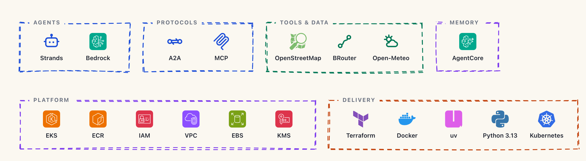
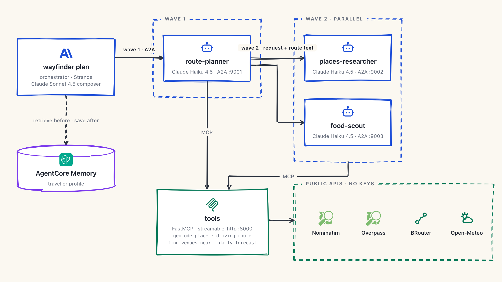
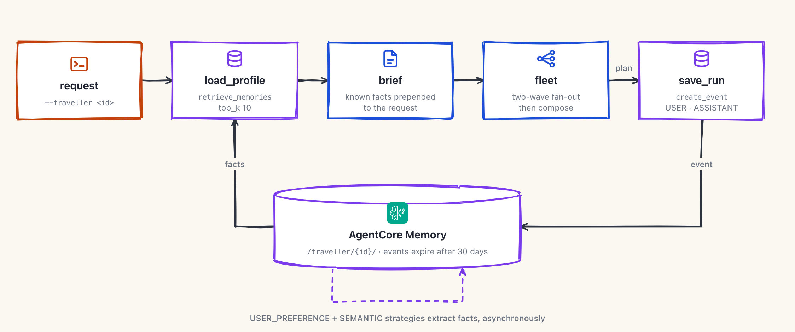
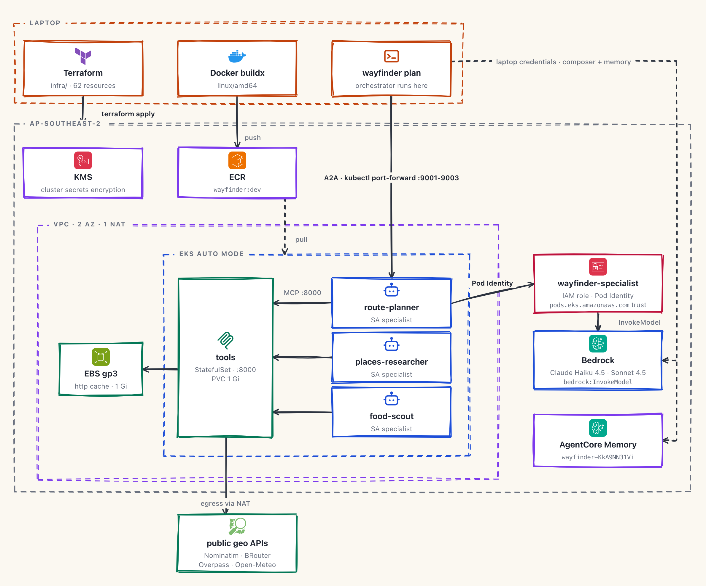

# Wayfinder

A multi-agent road-trip planner. One orchestrator fans out to three specialists over A2A; the specialists share one MCP tools server over public OpenStreetMap and Open-Meteo APIs, so there are no API keys. Runs on EKS Auto Mode, models on Bedrock, traveller memory on Bedrock AgentCore.

The fan-out is an explicit `asyncio.gather` in code, not tool-choice by the model, so it is actually parallel and reproducible. Two waves: `route-planner` first, then `places-researcher` and `food-scout` together with the route in hand.

## Stack

<picture>
  <source media="(prefers-color-scheme: dark)" srcset="docs/architecture/stack-dark.png">
  
</picture>

## The fleet

<picture>
  <source media="(prefers-color-scheme: dark)" srcset="docs/architecture/fleet-dark.png">
  
</picture>

| Agent | Does |
|---|---|
| `wayfinder plan` | Loads the traveller profile, runs the fan-out, composes the plan |
| `route-planner` | Real driving legs, split into days under a fatigue cap |
| `places-researcher` | Stops near the route, with opening hours where OSM has them |
| `food-scout` | Venues matching a dietary tag, every claim citing its OSM source |
| `tools` | FastMCP: `geocode_place`, `driving_route`, `find_venues_near`, `daily_forecast` |

A dead specialist returns `[name unavailable]` and the plan still composes, saying what is missing. Allergy warnings from `food-scout` are carried through verbatim.

## Memory

<picture>
  <source media="(prefers-color-scheme: dark)" srcset="docs/architecture/memory-dark.png">
  
</picture>

With `--traveller <id>`, known facts are prepended to the request before the run and the finished run is saved after. AgentCore extracts durable facts in the background, so they apply on the *next* trip.

## On EKS

<picture>
  <source media="(prefers-color-scheme: dark)" srcset="docs/architecture/eks-dark.png">
  
</picture>

Terraform in `infra/` provisions everything. Pods get Bedrock access through Pod Identity: the `specialist` ServiceAccount is bound to an IAM role, so no credentials are mounted. Manifests are one Kustomize base plus a `minikube` and an `eks` overlay.

## Run it

```bash
uv sync
cp .env.example .env
```

Laptop:

```bash
just fleet
just demo
```

Cluster:

```bash
just image minikube && just deploy minikube
just infra-up && just kubeconfig
just image eks && just deploy eks
just forward
just infra-down
```

Memory: `uv run python scripts/create_memory.py` prints a `MEMORY_ID` for `.env` and `infra/variables.tf`.
